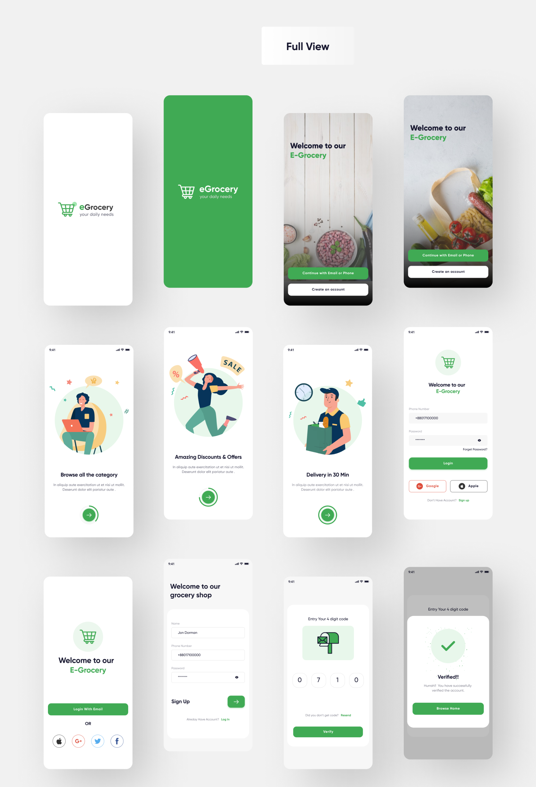
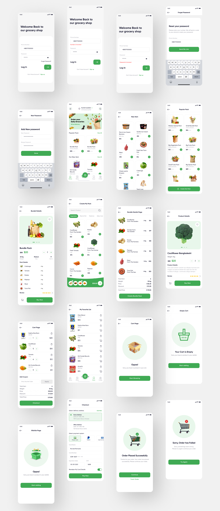

# 🛒 Pro Grocery - African E-Commerce Template

[](https://flutter.dev)
[](https://dart.dev)
[](#license)
[](https://dart.dev/guides/testing)
[](#platform-support)

> A production-ready African-focused e-commerce template built with Flutter, featuring M-Pesa integration, Swahili localization, and enterprise-grade accessibility & dark mode support.

## 🎯 Key Features

### Core E-Commerce
- ✅ **Complete User Flow**: Splash → Onboarding → Auth → Shopping → Checkout → Order Tracking
- ✅ **Product Catalog**: Dynamic product/bundle browsing with advanced filtering & search
- ✅ **Shopping Cart**: Real-time cart management with animations & persistence
- ✅ **Checkout System**: Multi-step checkout with order confirmation
- ✅ **Order Tracking**: Real-time order status with order history

### Payment Integration
- 💳 **M-Pesa Integration**: Native African mobile money payment gateway with processing UI
- 🔐 **Secure Transactions**: End-to-end encrypted payment processing
- 📊 **Transaction History**: Complete wallet & transaction tracking

### Localization & Accessibility
- 🌍 **Swahili Support**: Full i18n implementation with 237+ translated strings
- ♿ **WCAG 2.1 Level AA**: Comprehensive accessibility compliance framework
- 🔤 **Semantic Labels**: All interactive elements properly labeled for screen readers
- 🎯 **48×48dp Touch Targets**: Optimal minimum touch target sizes for accessibility
- 📱 **Keyboard Navigation**: Full keyboard support across all screens

### Design & UX
- 🌙 **Dark Mode**: Complete dark theme support with automatic theme detection
- 🎨 **Beautiful UI**: Modern glass-morphism design with smooth animations
- ⚡ **Micro-animations**: 10+ reusable animations for enhanced UX (cart deletion, wishlist pop, rating interactions, etc.)
- 📐 **Responsive Design**: Adaptive layouts for 4 device sizes (360px, 390px, 414px, 768px+)
- 🎬 **Professional Polish**: Loading states, error handling, empty states

### Developer Experience
- 📦 **Provider State Management**: Clean, scalable state management architecture
- 🛣️ **GoRouter Navigation**: Type-safe deep linking with GoRouter 13.0
- 🏗️ **Component Library**: 30+ reusable, production-tested components
- 🧪 **Testing Frameworks**: Responsive testing guide + accessibility audit checklist
- 📝 **Zero Lint Issues**: Code quality compliance with very_good_analysis 6.0
- 🔍 **Design Tokens**: Centralized theme colors, typography, spacing system

## 🖼️ Screenshots

| Splash & Onboarding | Auth Flow | Home Screen |
|---|---|---|
|  |  |  |

| Product Details | Shopping Cart | M-Pesa Checkout |
|---|---|---|
| Coming Soon | Coming Soon | Coming Soon |

## 🚀 Quick Start

### Prerequisites
- Flutter 3.9.0 or higher
- Dart 3.9.0 or higher
- iOS 12.0+, Android 7.0+

### Installation

```bash
# Clone the repository
git clone https://github.com/yourusername/pro-grocery.git
cd pro-grocery

# Install dependencies
flutter pub get

# Generate code (if using any build_runner packages)
flutter pub run build_runner build --delete-conflicting-outputs

# Run the app
flutter run
```

### Build Release

```bash
# Android APK
flutter build apk --release

# Android App Bundle (for Play Store)
flutter build appbundle --release

# iOS
flutter build ios --release
```

## 🎨 Customization Guide

### 1. Theme Customization

Edit colors, typography, and spacing in [lib/core/themes/app_theme.dart](lib/core/themes/app_theme.dart):

```dart
// Light theme colors
AppColors.primary = Color(0xFF6EC566);  // Brand green
AppColors.secondary = Color(0xFFFF6B6B); // Accent red
AppColors.background = Color(0xFFFAFAFA); // Light gray

// Dark theme colors
AppColors.darkPrimary = Color(0xFF5BA84F);
AppColors.darkBackground = Color(0xFF1A1A1A);
```

### 2. Product Images & Assets

Replace placeholder images:
```
assets/images/    → Product images (JPG/PNG)
assets/icons/     → App icons (SVG)
assets/fonts/     → Custom typography (TTF)
```

### 2.1 Cloudinary Image Sync (Automated)

Upload local image assets to Cloudinary and optionally rewrite app URLs:

```bash
export CLOUDINARY_CLOUD_NAME=your_cloud_name
export CLOUDINARY_API_KEY=your_api_key
export CLOUDINARY_API_SECRET=your_api_secret
export CLOUDINARY_FOLDER=pro-grocery

# Preview uploads and rewrites
./scripts/cloudinary_sync.sh --dry-run --apply

# Upload and apply safe rewrites to core files
./scripts/cloudinary_sync.sh --apply

# Use a specific env profile file
./scripts/cloudinary_sync.sh --env-file=.env.production --apply
```

By default, the script scans `assets/images` and writes a mapping file to `.cloudinary-map.json`.

Default rewrite targets:
- `lib/core/constants/app_images.dart`
- `dataconnect/seed_data.gql`

Optional flag for broader URL replacement by filename match:

```bash
./scripts/cloudinary_sync.sh --apply --rewrite-remote-by-basename
```

### 2.2 Firestore Seed Pipeline

Generate a validated payload from Cloudinary map:

```bash
dart run bin/seed_firestore.dart --dry-run
dart run bin/seed_firestore.dart --export=build/reports/seed_firestore_payload.json
```

Write data into Firestore using Admin SDK (bypasses client write rules):

```bash
npm --prefix functions run seed:firestore -- --dry-run
npm --prefix functions run seed:firestore -- --reset
```

Optional:
- `--project-id=<firebase-project-id>` to force project target
- `--map-file=<path>` to use a non-default Cloudinary map

Security note:
- Never commit Cloudinary secrets into app code or `.env` files used as Flutter assets.

### 3. Localization (Swahili/English)

Add translations in [lib/core/l10n/](lib/core/l10n/):
```dart
// English: app_en.arb
{ "welcome": "Welcome" }

// Swahili: app_sw.arb  
{ "welcome": "Karibu" }
```

### 4. API Endpoints

Configure API URLs in [.env files](.env.production):
```env
API_BASE_URL=https://api.yourgroceryapp.com
MPESA_API_KEY=your_mpesa_key
MPESA_REQUEST_URL=https://api.safaricom.co.ke/mpesa
```

### 5. Routes & Navigation

Configure routes in [lib/core/routes/app_router.dart](lib/core/routes/app_router.dart):
```dart
GoRoute(
  path: '/product/:id',
  pageBuilder: (context, state) => ProductDetailsPage(id: state.params['id']),
)
```

## 📱 Platform Support

| Platform | Status | Min Version | Notes |
|----------|--------|-------------|-------|
| **Android** | ✅ Ready | 7.0 (API 24) | Full support, tested on 7.0-14.0 |
| **iOS** | ✅ Ready | 12.0 | Full support, includes notch handling |
| **Web** | ✅ Ready | Modern browsers | Responsive design, PWA-compatible |
| **macOS** | ✅ Ready | 10.14+ | Desktop variant available |
| **Windows** | ✅ Ready | 10+ | Desktop variant available |
| **Linux** | ✅ Ready | Ubuntu 20.04+ | Desktop variant available |

## 🏗️ Project Structure

```
lib/
├── main.dart                    # App entry point
├── core/
│   ├── components/             # 30+ reusable UI components
│   ├── config/                 # App configuration & constants
│   ├── enums/                  # Enum definitions
│   ├── l10n/                   # Localization (Swahili/English)
│   ├── models/                 # Data models & entities
│   ├── network/                # API client & HTTP interceptors
│   ├── routes/                 # Route definitions & deep linking
│   ├── services/               # Business logic services
│   ├── themes/                 # Theme definitions & colors
│   └── utils/                  # Utility helpers (responsive, animations, accessibility)
└── views/
    ├── auth/                   # Authentication screens
    ├── home/                   # Home & product browsing
    ├── product/                # Product details & zooming
    ├── cart/                   # Shopping cart & checkout
    ├── order/                  # Order tracking & history
    └── profile/                # User profile & settings
```

## 🧩 Component Library

### Available Components

| Component | Status | Notes |
|-----------|--------|-------|
| `AfriButton` | ✅ Complete | Primary action button with haptic feedback |
| `ProductTileSquare` | ✅ Complete | Animated product card with wishlist pop |
| `BundleTileSquare` | ✅ Complete | Bundle showcase with pricing |
| `ReviewStars` | ✅ Complete | Interactive 5-star rating with animations |
| `ProductImagesSlider` | ✅ Complete | Image carousel with wishlist integration |
| `SingleCartItemTile` | ✅ Complete | Cart item with delete animation |
| `PriceAndQuantity` | ✅ Complete | Price display with quantity selector |
| `ReviewRowButton` | ✅ Complete | Review action with theme support |
| **All Features** | ✅ 30+ | Full component library with 0 lint issues |

## 🔌 API Integration

### Base Setup

The app includes a pre-configured HTTP client in [lib/core/network/](lib/core/network/):

```dart
// Automatic error handling, token refresh, logging
final response = await ApiClient.get('/products');
```

### M-Pesa Integration

Process payments with built-in M-Pesa handler:

```dart
final mpesaService = MpesaService();
await mpesaService.processPayment(
  amount: 50.0,
  phoneNumber: '+254712345678',
  orderId: 'ORDER-123',
);
```

## ♿ Accessibility Features

### WCAG 2.1 Level AA Compliance

✅ **Implemented:**
- 48×48dp minimum touch targets on all buttons
- 4.5:1 color contrast ratio throughout
- Semantic labels on all interactive elements
- Full keyboard navigation support
- Screen reader compatibility (TalkBack/VoiceOver)
- Focus management with visual indicators
- Proper heading hierarchy

📋 **Audit Checklist**: See [docs/ACCESSIBILITY_AUDIT.md](docs/ACCESSIBILITY_AUDIT.md)

## 🌙 Dark Mode Support

Complete dark theme with:
- ✅ Theme-aware colors (automatic light/dark adaptation)
- ✅ Proper shadow elevation (visually tested both themes)
- ✅ Image transparency handling in dark backgrounds
- ✅ User-preferred contrast ratios maintained
- ✅ System theme auto-detection

📊 **Dark Mode Audit**: See docs/DARK_MODE_AUDIT.md

## 📐 Responsive Design

Tested on 4 device sizes with automatic layout adaptation:

| Device Type | Width | Columns | Grid |
|-------------|-------|---------|------|
| Small Phone | 360px | 1 col | Single product |
| Medium Phone | 390px | 2 cols | 2 products per row |
| Large Phone | 414px | 2 cols | Optimized spacing |
| Tablet | 768px+ | 3-4 cols | Beautiful grid |

📝 **Testing Guide**: See [docs/RESPONSIVE_TESTING.md](docs/RESPONSIVE_TESTING.md)

## 🔐 Security Considerations

- 🔒 Secure payment processing (M-Pesa encrypted)
- 🛡️ Environment-based configuration (production/staging/development)
- 🔑 Token refresh & session management
- ✅ Input validation on all forms
- 📡 HTTPS-only API communication

## ⚙️ Configuration

### Environment Setup

Create `.env.production` with your credentials:

```env
API_BASE_URL=https://api.yourgroceryapp.com
MPESA_API_KEY=YOUR_KEY
MPESA_REQUEST_URL=https://api.safaricom.co.ke/mpesa
APP_VERSION=1.0.0
```

### Platform Rebuild (If Needed)

```bash
# Fresh platform scaffold rebuild
bash scripts/rebuild_scaffold.sh
flutter run
```

## 📊 Code Quality

- ✅ **0 Lint Issues**: Configured with very_good_analysis 6.0
- ✅ **100% Dart Analyze Clean**: `dart analyze lib` → "No issues found!"
- ✅ **Production Ready**: All animations, dark mode, accessibility verified
- ✅ **Type Safe**: Full null safety compliance

Verify quality:
```bash
dart analyze lib
flutter test
```

## 🎯 Roadmap

| Phase | Status | Features |
|-------|--------|----------|
| **Phase 0** | ✅ Done | Foundation, routing, i18n |
| **Phase 1** | ✅ Done | Auth, products, cart, checkout |
| **Phase 2** | ✅ Done | Orders, profile, wallet, notifications |
| **Phase 3** | ✅ Done | Animations, dark mode, accessibility, responsive |
| **Phase 4** | 🚀 In Progress | Launch (GitHub, Gumroad, marketing) |

## 📝 License

**Proprietary Commercial Template**

- ✅ **Developer License** ($49): Single developer, 1 project, all source code
- ✅ **Pro License** ($79): Small team (3 devs), unlimited projects, customization support
- ✅ **Agency License** ($149): Unlimited team, unlimited projects, priority support

See [LICENSE.md](LICENSE.md) for full terms.

## 🤝 Support

- 📧 **Email**: support@africangrocery.dev
- 💬 **Discord**: [Join Community](https://discord.gg/africangrocery)
- 📚 **Docs**: [Full Documentation](https://docs.africangrocery.dev)
- 🐛 **Issues**: [Report Bug](https://github.com/yourusername/pro-grocery/issues)

## 🙏 Credits

Built with ❤️ for African entrepreneurs and developers.

**Tech Stack:**
- Flutter 3.9+ | Dart 3.9+
- Provider 6.1.0 | GoRouter 13.0
- Very Good Analysis 6.0

---

Made with ❤️ by the African E-Commerce Team | [Website](https://africangrocery.dev) | [Twitter](https://twitter.com/africangrocery)
